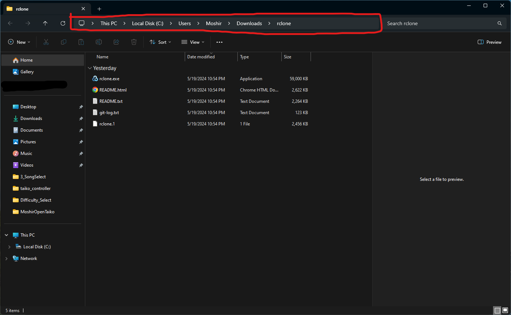
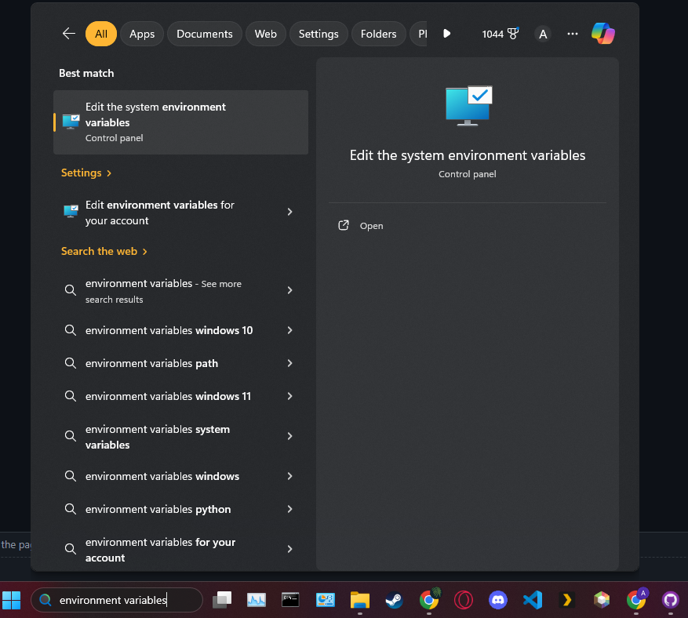
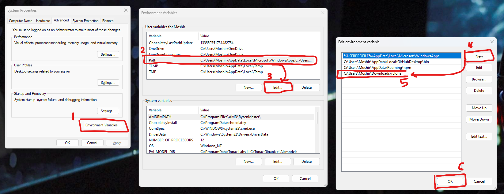
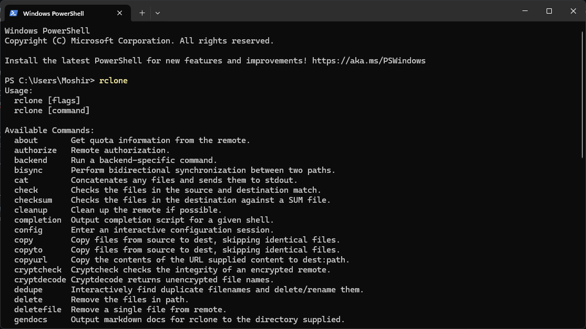
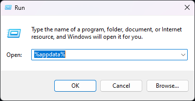
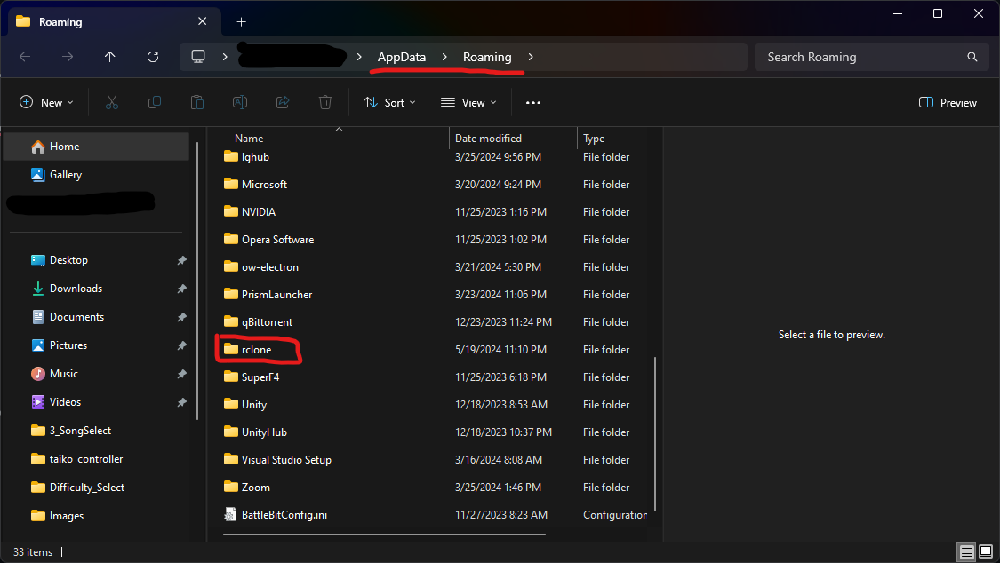
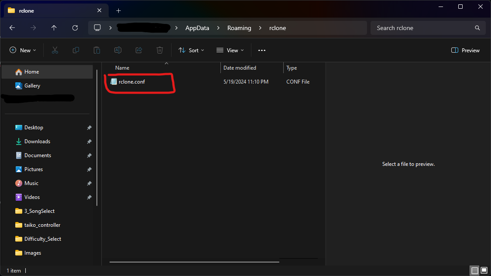
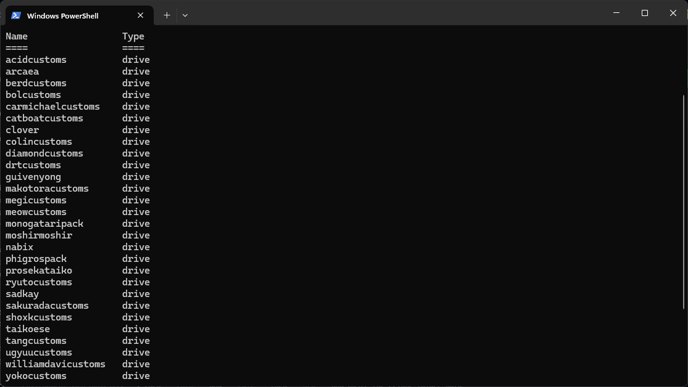

# openTaiko rclone
This is an easy step-by-step written guide to setup up rclone as well as to configure it with all the drives/remotes for all the awesome charters in the community! 

You can also view the original video guide to setup rclone by Meowgister [here](https://www.youtube.com/watch?v=bMj7AFF_ShI)

## Getting Started
### Download rclone
The first thing you'll need to do is get [rclone](https://rclone.org/). Go to the rclone's [Downloads Page](https://rclone.org/downloads/) and download the correct version for your computer (it should probably be the top left one: ```Intel/AMD - 64 Bit | Windows```).

### Setup path for rclone
In order to be able to run rclone and the sync/check files, you'll need to setup an environmental variable so your computer can recognize how to call the rclone command.

1. Find the folder where you downloaded rclone and copy the address bar, we'll need this later

> It should be something like this: ```C:\Users\Moshir\Downloads\rclone```

2. Search for ```environment variables``` in your windows search bar and open the result


3. Select ```Environment Variables...```, then ```Path``` and ```Edit``` then ```New``` and paste the rclone folder path that you copied


4. You can now press ```Ok``` on all those windows and rclone can now be used in cmd or powershell!


## Setup rclone
### Copy rclone.conf to rclone config path
You'll need to copy my provided rclone.conf file into the correct location so that the remotes can be automatically setup

1. Press ```⊞ Win + r``` and type in ```%appdata%``` <br>


3. Ensure you are in ```../AppData/Roaming``` and find the rclone folder (if it is not there, then create a folder named ```rclone```)


5. Copy the provided rclone.conf into that folder, replace the one there if it already has one


7. If done correctly, if you type in ```rclone config``` into powershell/cmd, it should list all the remotes 


### Reauthenticate rclone Remotes
I have compiled the reconnect commands into one .bat file to reauthenticate all the remotes, but you will still have to manually link your google account and allow each one

1. Run Setup.bat (this will open a window in your browser)
2. Select your google account and then press ```Allow```
3. Repeat step 2 until no more tabs open (It will do this 28 times total)

## Sync all the songs!
Now that we have rclone setup and all the remotes reauthenticated, all you have to do is go into my provided ```Songs``` folder and run* ```SyncAll.bat```. This will open a bunch of cmd windows that will run each sync.bat in each Charter's folder and  will download all the songs from google drive into the respective folders.
Once all the cmd windows close, all the songs are downloaded and ready to be played!

*I recommend copying the entire ```Songs``` Folder provided and pasting it in your OpenTaiko install **FIRST** before running SyncAll.bat (the provided folders in ```Songs``` and the ```SyncAll.bat``` should be in your ```Songs``` folder for OpenTaiko)
